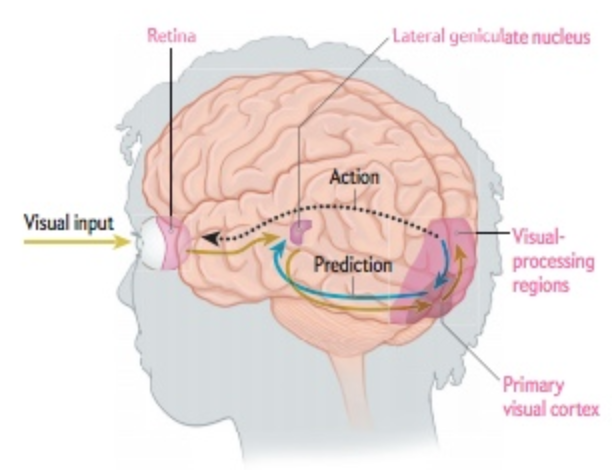
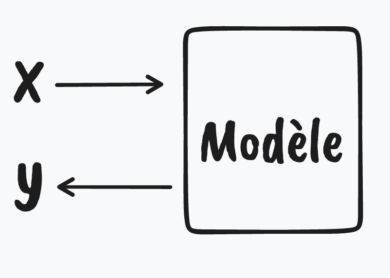
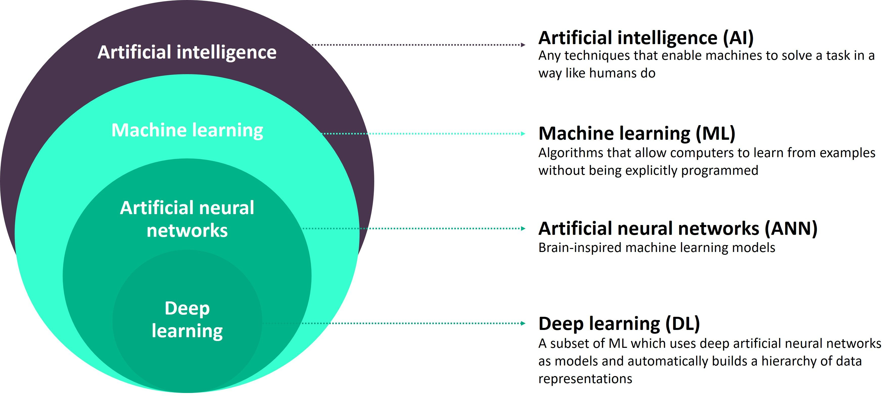
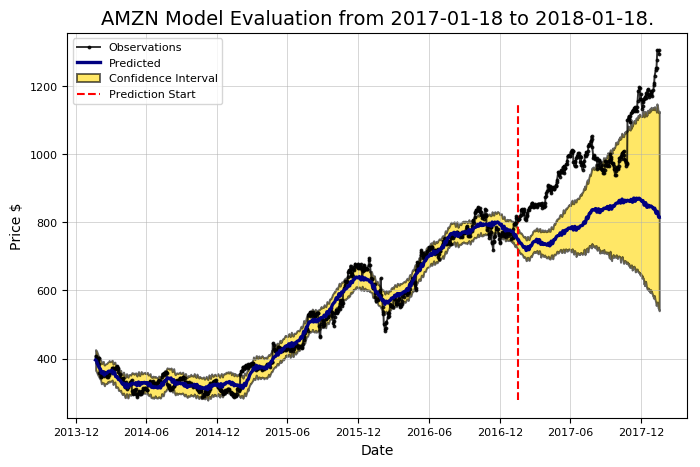
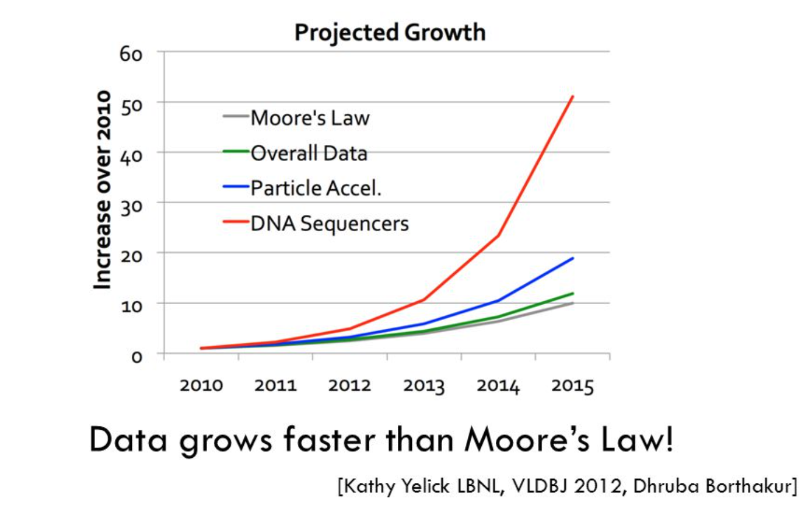

autoscale: true
build-lists: true
slidenumbers: true
footer: Mehdi Brahimi, Ph.D.

# Introduction au Machine Learning[^1] et à l’Intelligence Artificielle

[^1]: Apprentissage automatique

---
## Faisons connaissances

Mehdi Brahimi[^2], Ph.D

2014-2018 Ingénieur R&D
2018-2019 Lead Data Scientist
2019-2022 Principal ML Engineer

__A votre tour de vous présenter__
- entreprise
- background
- langage de programmation

[^2]: Vous pouvez me retrouver sur linkedin https://www.linkedin.com/in/mehdi-brahimi/

---
## Programme

Jour 1 - Introduction au Machine Learning et ses applications
Jour 2 - Marketing Digital et AI/ML
Jour 3 - Machine Learning en pratique : Outils pour l'analyse de données et construction de modèles de ML
Jour 4 - Cas d'etude: prédiction de l'attrition et ses leviers
Jour 5 - Cas d'étude: segmentation de clients

---
## Qu'est-ce que l'IA et le Machine Learning ?

---
## Histoire de l'intelligence artificielle
CEA

---
## Définition

> "Systems that perform actions that if performed by humans would be considered intelligent." 
"Des systèmes qui effectuent des actions qui, si elles étaient effectuées par des humains, seraient considérées comme intelligentes."
-- John McCarthy the "Father of AI"

---
## Le cerveau une machine qui fait des prédicitons

---
## IA ? ML ? DL ?

---
## IA ? ML ? DL ?

L'__intelligence artificielle (IA)__ est « l'ensemble des théories et des techniques mises en œuvre en vue de réaliser des machines capables de simuler l'intelligence humaine »

L'__apprentissage automatique__ (en anglais : Machine Learning), est un champ d'étude de l'intelligence artificielle qui se fonde sur des approches mathématiques et statistiques pour donner aux ordinateurs la capacité d'« apprendre » à partir de données, c'est-à-dire d'améliorer leurs performances à résoudre des tâches sans être explicitement programmés pour chacune. 

Un __réseau de neurones artificiels__ (en anglais : Artificial Neural Networks (ANN)), est un système dont la conception est à l'origine schématiquement inspirée du fonctionnement des neurones biologiques, et qui par la suite s'est rapproché des méthodes statistiques.

L'__apprentissage profond__ (en anglais : deep learning) est un ensemble de méthodes d'apprentissage automatique tentant de modéliser avec un haut niveau d’abstraction des données grâce à des architectures articulées de différentes transformations non linéaires. 

---
## Question

Lequel des énoncés suivants décrit le mieux une machine qui correspondrait à la définition de l'IA de John McCarthy ?

- [ ] La machine peut contenir des quantités massives de données
- [ ] La machine répond aux questions d'un humain de telle manière que l'humain ne peut pas dire qu'il s'agit d'une machine
- [ ] La machine effectue des tâches qui, si elles étaient effectuées par un humain, seraient considérées comme intelligentes
- [ ] La machine peut se déplacer comme un humain !

---
## Réponse

- [ ] La machine peut contenir des quantités massives de données
- [ ] La machine répond aux questions d'un humain de telle manière que l'humain ne peut pas dire qu'il s'agit d'une machine
- [X] La machine effectue des tâches qui, si elles étaient effectuées par un humain, seraient considérées comme intelligentes
- [ ] La machine peut se déplacer comme un humain !

---
## Quelques applications de l'AI/ML

---
## Qu'est-ce que X ? Que-est-ce que Y ?

---
## Détection d'objects
[^4]

[^4]: Véhicules Autonomes

---
## Détection d'objects

---
## Classification

---
## Détection de texte (OCR)

---
## Traduction

__English__: “You cannot answer a question that you cannot ask, and you cannot ask a question that you have no words for.”

__Italiano__: “Non puoi rispondere a una domanda che non puoi fare, e non puoi fare una domanda per cui non hai parole.”

---
## Classification de texte

- spam filtering
- analyse d'articles scientifiques
- analyse de textes

---
## Prédiction de texte

Live Demo!

---
## Analyse de sentiment

- permet de classer automatiquement les commentaires (reviews)
- permet de détecter des commentaires mal noté
- d'autres applications (discours politiques, etc)

---
## Moteur de recherche
- Les moteurs de recherche apprennent à partir des retours des utilisateurs pour améliorer les résultats

---
## Recommendation

- Netflix
- Amazon
- Facebook, Instagram timeline
- Youtube next video

---
## Prediction de série temporelles

- prévision des stocks
- Bourse
- Prévisions météo
- Prévision du compagne marketing
- Prédiciton de la croissance
- etc.

---
## Apprentissage de fonctions complexes
S & H

---
## Apprentissage de fonctions complexes
Alpha go

---
## GPT-3
*

---
## Et plus encore

https://thissneakerdoesnotexist.com/

https://thispersondoesnotexist.com/

https://gpt3demo.com/

---
## Un peu de pratique !

---
## Question

Lequel des exemples ci-dessous ressemblerait le plus à la définition la plus pratique de l'IA de John McCarthy ?

- [ ] Une machine qui a AGI (Artificial General Intelligence), ce qui signifie qu'elle a une conscience
- [ ] Une machine qui a des émotions et peut faire preuve d'empathie et de compassion
- [ ] Une machine qui reconnaît les objets et est capable de classer les images comme le ferait un humain, mais avec une plus grande précision
- [ ] Une machine qui répond à la question de telle manière qu'aucun humain ne serait capable de dire si les réponses venaient d'une machine ou d'un humain

---
## Question

La clinique des Pins Maritimes a décidé d'utiliser l'IA pour aider à identifier les tumeurs cancéreuses dans les radiographies et les IRM des patients. L'IA "regarde" l'image et trouve la tumeur, si elle est là. Laquelle des applications suivantes de l'IA en marketing décrites par Raj cette situation illustre-t-elle ?

- [ ] Reconnaissance d'objets (Google Lens)
- [ ] Classification des images (chien vs muffin)
- [ ] Aucune de ces options
- [ ] La classification d'images et la reconnaissance d'objets

---
## Question

Que signifie le terme « Data-Driven AI? »

- [ ] L'IA est fournie avec un ensemble de données, et elle proposera ensuite à la fois le résultat et l'ensemble de règles qui conduiront à ce résultat
- [ ] Aucune de ces réponses
- [ ] L'IA reçoit un ensemble de données et un certain ensemble de règles pour arriver à un résultat
- [ ] L'IA reçoit un ensemble de données et un résultat pour proposer un certain ensemble d'instructions

---
## Question

Quel a été le plus grand contributeur à la révolution du Big Data et à l'augmentation associée de la facilité de collecte de données au cours de la dernière décennie ?
- [ ] Invention d'algorithmes d'IA modernes
- [ ] Apparition d'infrastructures cloud comme AWS, Azure ou Google cloud
- [ ] Les grandes universités ont créé des programmes de science des données et donc plus de talents sont apparus dans le domaine
- [ ] L'apparition des smartphones et des applications pour smartphones, en particulier les réseaux sociaux, a rendu la collecte de données très facile

---
## Réponse

---
## Réponse

---
## Question

Comment s'appelle l'IA qui a battu le champion mondial du jeu de GO ?
- [ ] StarGo
- [ ] DeepGo
- [ ] AlphaGO
- [ ] FastGO

---
## Bien, passons la suite !

