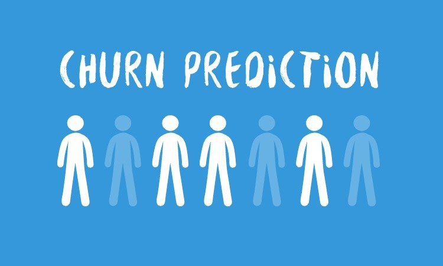

autoscale: true
build-lists: true
slidenumbers: true
footer: Mehdi Brahimi, Ph.D.

# Marketing et Machine Learning

---
# Améliorer la connaissance du marché
---
## Identification et ciblage du marché

* la quantité de données dans le marketing digitale est trop importante pour pouvoir la traiter manuellement
* On peut utiliser les algorithmes de ML pour:
	* identifier les différents types de clients sur le matché
	* identifier les messages les plus pertinents à diffuser (le cotenu, l'image, couleur, etc.)

^
* Les campagnes digitales génère tellement de données qu'il en devient impossible de les traiter manuellement.
* On  peut utiliser un algorithme de ML pour le faire à notre place:
	* se concentrer sur l'identification des personas du marché
	* Vous pouvez également déterminer les messages auxquels vos clients répondent le plus. (le messages, ça peut être une image, ça peut être une couleur, ça peut être des mises en page) 

Exemple: [Harley Davidson](https://hbr.org/2017/05/how-harley-davidson-used-predictive-analytics-to-increase-new-york-sales-leads-by-2930) a doublé ses ventes grace à une campagne Marketing basée sur le marketing.

---
## Identification et ciblage du marché

* __ML Process__:
	1- analyser les données clients (temps passé sur votre site internet, ajout d'un item, souscription à la newsletter)
	2- Organiser les groupements. Le ML nous permeettre de définir des groupes de profils type.
	3- Exécutez des campagnes marketing sur ces groupes cibles, pour valider certaines hypothèse. (Campagne minimum viable)
	4- scale-up après la modélisation. 

---
## Identification et ciblage du marché

Use Case !
dataset: 01-02-Target.csv

---
## Media planning et implementation 

* Le prix moyen d'une annonce numérique est d'environ 1,50 $ par clic. Une publicité Superbowl coûte cinq millions de dollars pour 30 secondes de temps d'antenne.
* il existe différents médias à différents prix, pour différents publics, à différentes fins
* omment comparer des pommes avec des pommes entre une publicité sur les réseaux sociaux et une publicité pendant le Superbowl ? La réponse, l'analyse comparative.
* cost per action (CoIut par action)
* Seven Times Rule (to trigger a response)

---
## Media planning et implementation 

Use case !
dataset: 01-04-Media.csv

---
# Augmenter l'engagement
---
## Prédire la demande 

* La capacité à prédire l'offre permet de prévoir les stocks et d'ajuster les budgets de campagnes publicitaires
* Avoir une idée précise sur la demande client, permet de mieux approvisionner les stocks et d'augmenter les marges

---
## Prédire la demande 

Live Demo !

dataset: 

---
## Prédiction de l'attrition

* l'attrition (churn en anglais) est la mesure du nombre de client qui vont se désabonner d'un service 
* A titre d'exemple:
	* L'attrition dans les services financiés: 15%
	* Telecommunications: 1%

* Machine Learning peut aider à prédire l'attrition et la comprendre.

---
## Prédiction de l'attrition

Live Demo !

dataset: 02-04-chrun.csv

---
# Améliorer l'engagement des client actifs

---
# Améliorer l'engagement client

---
# Améliorer l'engagement client

---
## Améliorer la satisfaction clien

* Cibler ce qui est réellement important pour les clients et former les employer à y répondre.
* Capturez les réponses émotionnelles et cognitives des clients en temps réel.
* Repérez et évitez la baisse des ventes.
* Prioriser les actions pour améliorer l'expérience client.
* Réduire les coûts
* Augmenter le temps de réponse

Exemple : L'entreprise [Strategic Education](https://hbr.org/sponsored/2020/12/ai-and-chatbots-can-help-organizations-meet-rising-customer-expectations) n'a eu que 7% des conversations ont dû être transférées aux membres du personnel..

---
## Prédiction de l'attrition

Live Demo !

dataset: Cloud Sevices

---
## Automatiser la personnalisation

* Customer advoacacy : faites de vos clients les portes paroles de votre marque.
* la détection d'objet pourrait aider à analyser les données sur les réseaux sociaux pour connaitre l'avis des cliens sur votre marque. 

Example : les 100 ans de [Coca Cola](https://digiday.com/marketing/coca-cola-celebrates-100-years-glass-contour-bottle-microsofts-howoldrobot/). 

^
La utilisé cette technologie pour célébrer le 100e anniversaire de la marque. Les utilisateurs ont été invités à télécharger une image d'eux-mêmes et d'une bouteille de Coca et le site Web traduirait cela en une prédiction de leur âge et une prédiction de l'âge de la bouteille également. C'était une façon amusante de personnaliser l'expérience et à son tour, l'entreprise a reçu 380 millions de soumissions d'images au cours de la première semaine seulement.

---
# Automatiser la personnalisation

Demo!

dataset: https://vize.ai/

---

# Type d'apprentissage en ML

