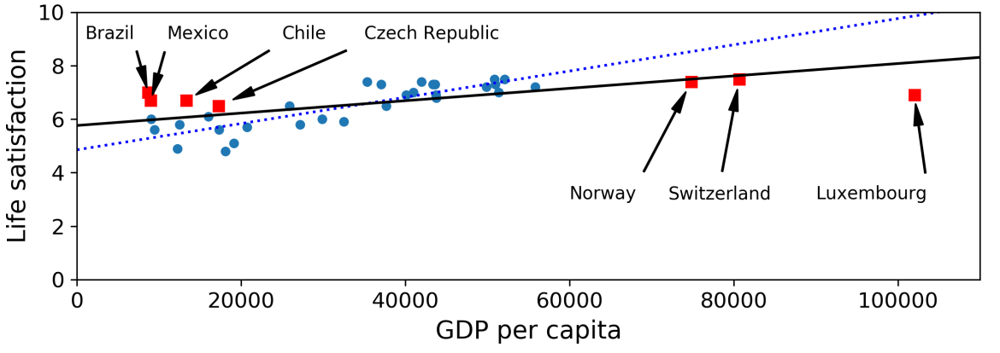

autoscale: true
build-lists: true
slidenumbers: true
footer: Mehdi Brahimi, Ph.D.


# Marketing et Machine Learning


---
# Améliorer la connaissance du marché
---
## Identification et ciblage du marché


* la quantité de données dans le marketing digitale est trop importante pour pouvoir la traiter manuellement
* On peut utiliser les algorithmes de ML pour:
	* identifier les différents types de clients sur le matché
	* identifier les messages les plus pertinents à diffuser (le cotenu, l'image, couleur, etc.)

^
* Les campagnes digitales génère tellement de données qu'il en devient impossible de les traiter manuellement.
* On  peut utiliser un algorithme de ML pour le faire à notre place:
	* se concentrer sur l'identification des personas du marché
	* Vous pouvez également déterminer les messages auxquels vos clients répondent le plus. (le messages, ça peut être une image, ça peut être une couleur, ça peut être des mises en page) 

Exemple: [Harley Davidson](https://hbr.org/2017/05/how-harley-davidson-used-predictive-analytics-to-increase-new-york-sales-leads-by-2930) a doublé ses ventes grace à une campagne Marketing basée sur le marketing.

---
## Identification et ciblage du marché


* __ML Process__:
	1- analyser les données clients (temps passé sur votre site internet, ajout d'un item, souscription à la newsletter)
	2- Organiser les groupements. Le ML nous permeettre de définir des groupes de profils type.
	3- Exécutez des campagnes marketing sur ces groupes cibles, pour valider certaines hypothèse. (Campagne minimum viable)
	4- scale-up après la modélisation. 

---
## Identification et ciblage du marché

Use Case !
dataset: 01-02-Target.csv

---
## Media planning et implementation 


* Le prix moyen d'une annonce numérique est d'environ 1,50 $ par clic. Une publicité Superbowl coûte cinq millions de dollars pour 30 secondes de temps d'antenne.
* il existe différents médias à différents prix, pour différents publics, à différentes fins
* omment comparer des pommes avec des pommes entre une publicité sur les réseaux sociaux et une publicité pendant le Superbowl ? La réponse, l'analyse comparative.
* cost per action (CoIut par action)
* Seven Times Rule (to trigger a response)

---
## Media planning et implementation 

Use case !
dataset: 01-04-Media.csv

---
# Augmenter l'engagement
---
## Prédire la demande 

* Prédire l'offre et la demande permet d'ajuster le budget de publicitaire


---
## Prédire la demande 

Live Demo !

dataset: 

---
## Prédiction de l'attrition

* L'attrition dans les services financiés: 15%
* Telecommunications: 1%

* Machine Learning peut aider à prédire l'attrition et la comprendre.

---
## Prédiction de l'attrition

Live Demo !

dataset: 02-04-chrun.csv

---
# Améliorer l'engagement client actif


---

# Type d'apprentissage en ML

---

# Type d'apprentissage en ML


---
# Apprentissage supervisé

* Étant donné X, peut-on prédire Y ?
	* __Classification__ — processus d'attribution d'une catégorie à l'échantillon de données d'entrée. Exemples d'usages : prédire si une personne est malade ou non, détecter les transactions frauduleuses, classifier les visages.
	* __Régression__ - processus de prédiction d'une valeur numérique continue pour un échantillon de données d'entrée. Exemples d'utilisations : évaluation du prix d'une maison, prévision de la demande alimentaire des épiceries, prévision de la température.


---
## Classification

| Leaf Width | Leaf Length | Species    |
|------------|-------------|------------|
| 2.7        | 4.9         | stetosa     |
| 3.2        | 5.5         | versicolor  |
| 2.9        | 5.1         | versicolor  |
| 3.4        | 6.8         | virginica   |


---
## Classification


---
## Régression


---
## Régression


---
# Apprentissage non-supervisé

* Étant donné X, peut-on inférer Y ?[^*]
	* Clustering
	* Détection d'anomalies
	* règles d'association
	* réduction de dimensionnalité

[^*]: Groupe d'algorithmes qui tentent de tirer des inférences à partir de données non étiquetées (sans référence à des résultats connus ou étiquetés). Dans l'apprentissage non supervisé, il n'y a pas de bonnes réponses.

---
## Clustering


---
## Clustering


---
## Règles d'association


---
## Détection d'anomalies


---
## Réduction de la dimensionnalité


---
## L'apprentissage par renforcement
* L'__apprentissage par renforcement__ consiste, pour un agent autonome (robot, etc.), à apprendre les actions à prendre, à partir d'expériences, de façon à optimiser une récompense quantitative au cours du temps.


---
## Type de problèmes

|   Type de problème  |    Description   |   Example   |
| ----------- | :-----------: | -----------: |
| Classification        		|    Choisissez l'une des N étiquettes     |    chat, chien, cheval, etc.    |
| Regression            		|       |      |
| Clustring             		|       |      |
| Règles d'association  		|       |      |
| Prédiciton de données structurée|       |      |
| Hiérarchisation (Recommendation)|       |      |
| Apprendre des actions dans un environnement|       |      |

---
## Question

Quel problème de ML est un exemple d'apprentissage non supervisé ?

- [ ] Clustering
- [ ] Régression
- [ ] Prédiciton de données structurée
- [ ] Classification


---
## Question

Quel problème de ML est un exemple d'apprentissage non supervisé ?

- [X] Clustering
- [ ] Régression
- [ ] Prédiciton de données structurée
- [ ] Classification


---
# Apprentissage en ligne ou par batch

---
# Apprentissage en ligne 


---
# Apprentissage "out-of-core" 


---
# Exercice

Pour chaque application présentée dans le cours. Identifier le problème ML impliquée.


---
### Quelques algorithmes par type d'apprentissage


---
# Principaux défis du Machine Learning


---
## Tendance ?


$$
life\_satisfaction = θ_0 + θ_1 × GDP\_per\_capita
$$

---
## Modèles simples


$$
life\_satisfaction = θ_0 + θ_1 × GDP\_per\_capita
$$

---
## Quantité insuffisante de données d'entraînement 

[^1]


[^1]: courbe extraite de Banko and Brill (2001), “Learning Curves for Confusion Set Disambiguation."

---
## Données non-représentatives




---
## Données de mauvaise qualité

* Si certaines observations sont clairement aberrantes, il peut être utile de simplement les supprimer ou d'essayer de corriger les erreurs manuellement.

* S'il manque quelques fonctionnalités à certaines instances (par exemple, 5% de vos clients n'ont pas spécifié leur âge), vous devez décider si vous souhaitez ignorer complètement cet attribut, ignorer ces instances, remplir les valeurs manquantes (par exemple, avec la médiane âge), ou entraînez un modèle avec la fonctionnalité et un modèle sans, et ainsi de suite.


---
## Caractéristiques non pertinentes

* _Feature Selection_ (Sélection des caractéristiques) : sélection des caractéristiques les plus utiles pour s'entraîner parmi les fonctionnalités existantes.
* _Feature Extraction_ : combiner des caractéristiques existantes pour en produire une plus utile (comme nous l'avons vu précédemment, les algorithmes de réduction de dimensionnalité peuvent aider).
* Création de nouvelles _Features_ en collectant de nouvelles données


---
### Surapprentissage (Overfitting the Training Data)


* Simplifier le modèle en en sélectionnant un avec moins de paramètres (par exemple, un modèle linéaire plutôt qu'un modèle polynomial à haut degré), en réduisant le nombre de _Features_ dans les données d'apprentissage ou en contraignant le modèle
* Recueillir plus de données d'entraînement
* Réduire le bruit dans les données d'apprentissage (par exemple, corriger les erreurs de données et supprimer les valeurs aberrantes)

---
## Sous-apprentissage (Underfitting the Training Data)
* Sélection d'un autre modèle, avec plus de paramètres
* Fournir de meilleures _Features_ à l'algorithme d'apprentissage (_Feature Engineering_)
* Réduction des contraintes sur le modèle (par exemple, réduction de l'hyper‐paramètre de régularisation)


---
## Test et validation


---
## Test et validation


---
## Réglage des hyperparamètres


---
## Réglage des hyperparamètres


---
##
Attention ! Algorithme ML ≠ Modèle ML


---
## Evaluation dans un problème de classification


---
## Evaluation d'un problème de régression

$$
MAE = (\frac{1}{n})\sum_{i=1}^{n}\left | y_{i} - x_{i} \right |
$$

$$
RMSE = \sqrt{(\frac{1}{n})\sum_{i=1}^{n}(y_{i} - x_{i})^{2}}
$$


```
import sklearn.metrics
import math

S1 = [2, 5, 9, 2]
S2 = [6, 3, 6, 1]

mae = sklearn.metrics.mean_absolute_error(S1, S2)

mse = sklearn.metrics.mean_squared_error(S1, S2)
rmse = math.sqrt(mse)
```
